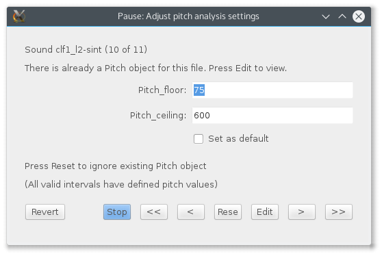

Although there is a culture of script-sharing among users of the Praat speech analysis program,[@praat] differences in researchers’ interests and the recording details of their corpora can render shared scripts difficult to use.
One source of difficulty stems from the need for user-specified parameters for Praat’s formant- and pitch-tracking algorithms.
The optimal parameters vary depending on the voice of the talker and the quality of the recording.
However, parameters may be hard-coded into the script’s source code (making them difficult to change for inexperienced programmers), or may be left unspecified in users’ scripts (in which case results will depend on whatever settings are in place on a particular computer at the time the script is run).

Even when analysis parameters are made easy to change (e.g., through well-documented source code, or a dialog box presented when a script is initially run), they are often set once for analysis of an entire corpus.
This is particularly problematic for analysis of speech from multiple talkers: errors such as pitch halving and spurious or unstable formant tracking become increasingly likely as automated scripts are applied to larger and more diverse corpora.
The problem is not in the algorithms themselves, but in their application: they are designed to be tweaked and tuned by human users in order to yield optimal results, but are being used as “fire and forget” tools.

To address these issues we present the “semiauto” collection of Praat scripts, designed to provide a middle ground between fully automatic and fully manual analysis workflows.
Measurement estimates are presented with an interface for adjusting algorithm parameters for every measurement taken.
At the same time, tedious manual oversight is avoided for steps in the analysis that are error-free when automated: opening files, zooming to temporal spans of interest, tabulating accepted measurements, etc.
By automating steps in the analysis workflow that do not require human intervention, the researcher can focus attention on only the analysis decisions whose accuracy depends on human judgment.
This significantly reduces time and effort, and eliminates many potential sources of user error.

The scripts take as input a collection of paired sound files and TextGrid annotation files.
Analysis points or intervals are found by a regular expression search through a designated TextGrid tier.
Users may specify the number of measurment points to be taken within each interval (i.e., a mean value for the interval, a single midpoint measurement, _n_ equally-spaced measurement times, or all available analysis frames).
The scripts can output pitch or formant frequency measurements, and can also output Praat Pitch and Formant object files for later analysis or additional automated measurement.
The algorithm parameters used for each interval are saved to a log file to aide reproducibility.
An integrated navigation tool helps users to move quickly within the current recording or across recordings in the corpus.
An example of the interface is shown in Figure 1.

The semiauto tools are designed to make high-reliability measurement feasible for small- to medium-sized corpora.
We expect them to be especially valuable for research questions where the uncertainty or noise inherent in automated measurement is intolerable; e.g., the study of near-mergers in vowel systems, subtly different intonation patterns, etc.

For easier distribution and use, the scripts are bundled as a Praat plugin.
The “semiauto” plugin can be installed manually or using CPrAN,[@cpran] a plugin management system for Praat which supports automatic installation, update, and testing for increased reliability.
A brief introduction to CPrAN will be included as part of the presentation of the semiauto tools.

# References {-}
